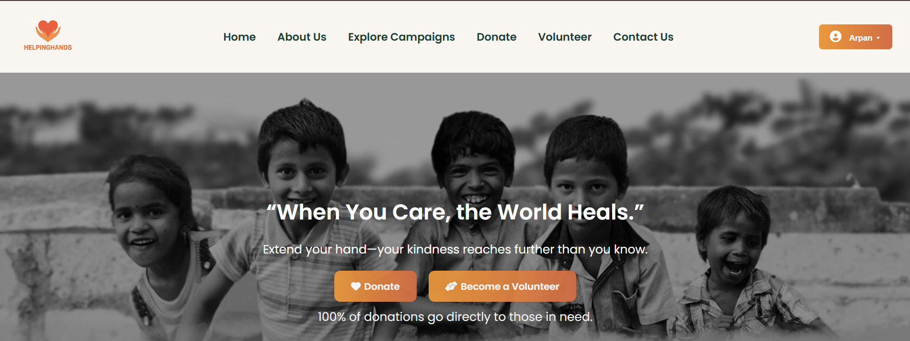
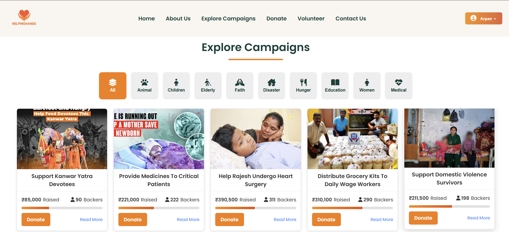
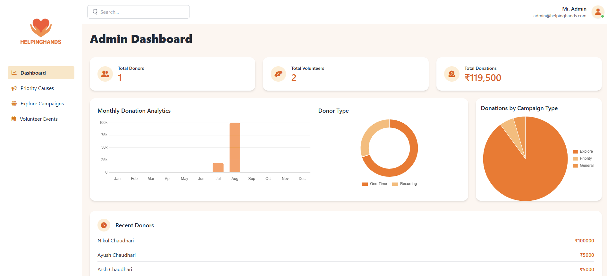

# HelpingHands NGO Website 🌍

HelpingHands is a web platform built with **Laravel**, designed to connect donors and volunteers with meaningful causes.  
The project makes it easy to donate, volunteer, and manage NGO campaigns online.

---

## 🚀 Features

- Donor & Volunteer Authentication  
- Donation System with campaign-wise tracking  
- Admin Dashboard (Users, Causes, Events, Donations)  
- Volunteer Event Management  
- Dynamic Home Page (Priority Causes, Testimonials, Impact, etc.)  
- Fully Responsive Frontend  

---

## 📸 Screenshots

## 📸 Screenshots

### 🏠 Home Page

### 💳 Donation Page

### 📊 Admin Dashboard

---
